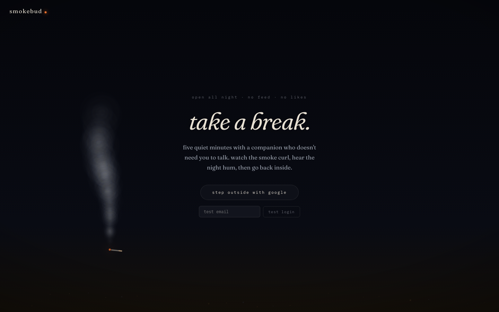
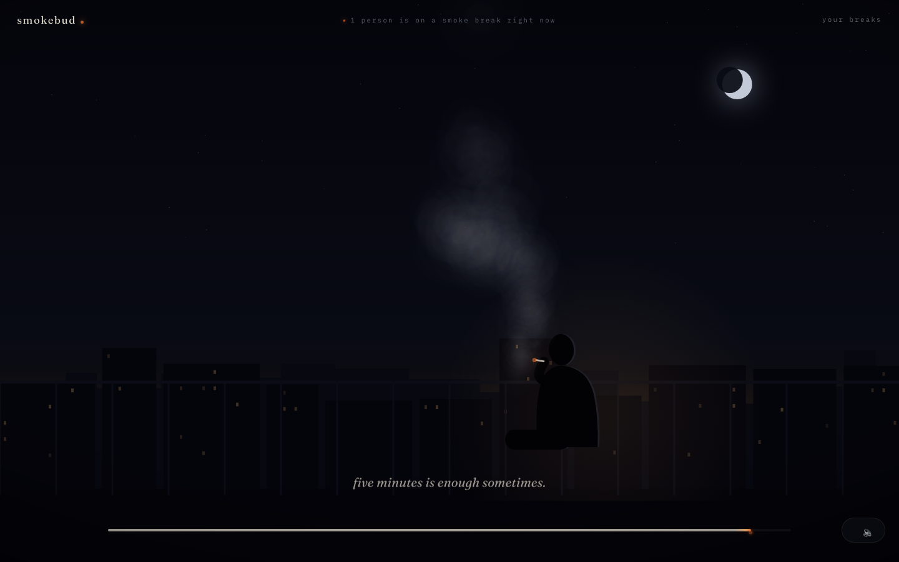

# smokeBud

a quiet website for taking a 5–6 minute "smoke break" with a virtual companion. built for lonely or stressed people who want a moment of low-key company. watch your companion light up, smoke, and share a quiet one-liner while you breathe. a live counter shows how many others are on a break right now.




## features

- **google sign-in** — authenticate seamlessly with your google account
- **living canvas scenes** — every wisp of smoke is simulated live: a curl-noise wind field, a breathing ember, and a companion who raises, drags, and exhales on a slow cycle. rainy companions get rain
- **companion clips** — or drop in ai-generated videos of your chosen companion; the canvas scene is the always-on fallback
- **live counter** — see how many others are taking a break right now
- **streaks & mood notes** — track your breaks with a heat-strip calendar at `/history` and keep private mood notes

## design

"2am fire escape": cool blue-black night, one warm ember. Fraunces carries the
whispered serif voice; IBM Plex Mono is the HUD — presence, dates, streaks —
pinned to the corners like a quiet OSD. film grain and a vignette frame every
screen. the shared smoke engine lives in `src/lib/smoke.ts`; the landing
backdrop and break scene both drive it.

more screens in [`docs/press/`](docs/press/), regenerable with
`npx tsx scripts/capture.ts` against a running e2e server.

## quick start

1. **set up environment**
   ```bash
   cp .env.example .env
   ```

2. **configure google oauth**
   - go to [google cloud console](https://console.cloud.google.com/)
   - create or select a project
   - configure the OAuth consent screen
   - create an oauth 2.0 client id (application type: web)
   - add authorized redirect uri: `http://localhost:3000/api/auth/callback/google`
   - copy `client id` and `client secret` to `GOOGLE_CLIENT_ID` and `GOOGLE_CLIENT_SECRET` in `.env`

3. **generate auth secret**
   ```bash
   openssl rand -base64 32
   ```
   paste the output into `AUTH_SECRET` in `.env`

4. **install and run**
   ```bash
   npm i
   npx prisma db push
   npm run dev
   ```
   open [http://localhost:3000](http://localhost:3000)

## adding companion clips

drop ai-generated video files into `public/companions/<id>/` to create new companions. files must match the manifest contract:

```
public/companions/<id>/
├── manifest.json
├── poster.jpg
├── lightup.mp4
├── loop-1.mp4
├── loop-2.mp4
├── loop-3.mp4
└── winddown.mp4
```

**manifest.json** declares file names and durations:
```json
{
  "name": "Your Companion",
  "scene": "scene description",
  "poster": "poster.jpg",
  "lightup": { "src": "lightup.mp4", "duration": 8 },
  "loops": [
    { "src": "loop-1.mp4", "duration": 26 },
    { "src": "loop-2.mp4", "duration": 30 },
    { "src": "loop-3.mp4", "duration": 29 }
  ],
  "winddown": { "src": "winddown.mp4", "duration": 8 }
}
```

missing files automatically fall back to the built-in canvas scene. see `public/companions/README.md` for details.

## testing

**unit tests:**
```bash
npm test
```

**end-to-end tests** (Playwright):
```bash
npm run e2e
```
boots an isolated e2e server on `:3100` with test-login stubbed—no google credentials needed.

## deploying

swap `DATABASE_URL` to a postgres connection string and change the prisma datasource `provider` from `sqlite` to `postgresql`. any node host works (e.g., vercel, railway, render).

## stack

- **frontend:** next.js (app router, typescript)
- **auth:** next-auth v5 (google + e2e test provider)
- **database:** prisma + sqlite (dev), postgres (production)
- **testing:** vitest (unit), playwright (e2e)
